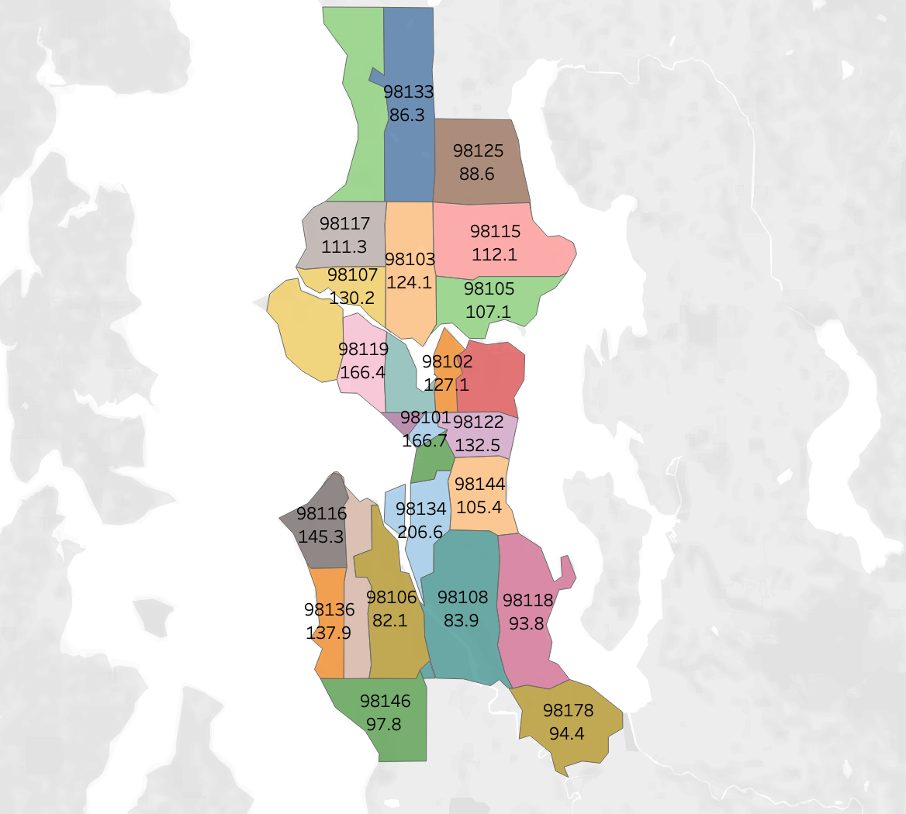
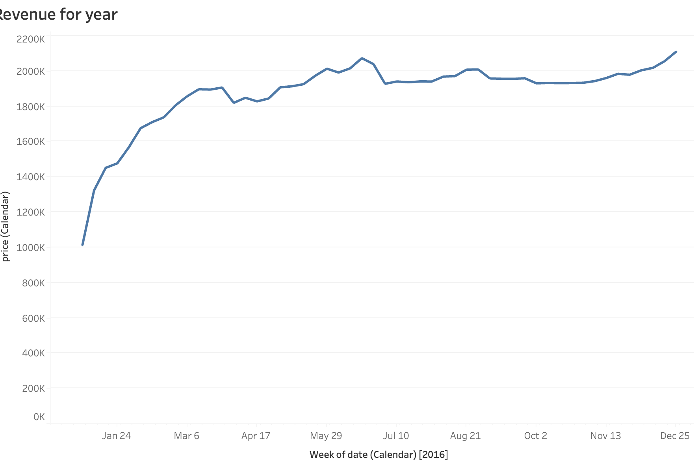
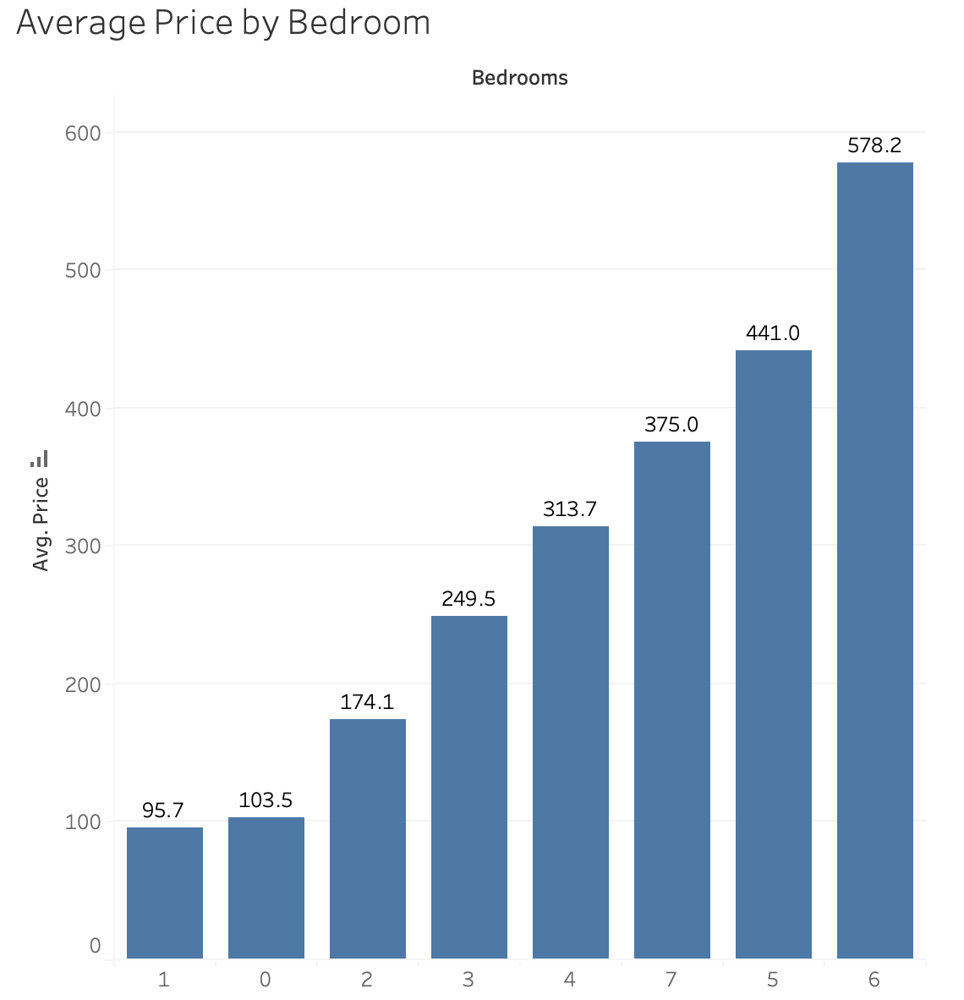
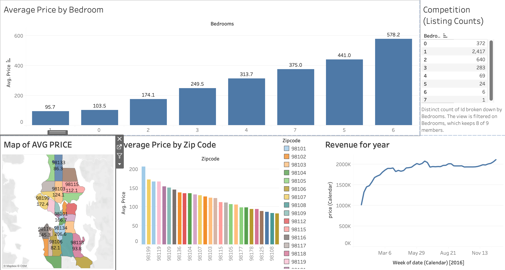

# Seattle AirBNB Project

### Dashboard Link : https://public.tableau.com/views/AirBnBDashboardProject_17259158037870/Dashboard1?:language=en-US&:sid=&:redirect=auth&:display_count=n&:origin=viz_share_link

## Problem Statement

This dashboard will help prospective property owners understand the market for AirBnB rentals in the Seattle area. By analysing average prices of rentals by zip code and size, insights can be made on if the user should start or expand their business to this territory. It will help the user understand the amount they can expect to make given the zip code and size of rental as well as what time of year has the hgihest sum of sales based on PY data.

The Seattle zip code [ 98134 ] has the highest average listing price for rentals which points to a great starting point for looking into potential properties. 

Also, the competition decreases as the room count on the property goes up. The average price of property also increases with room size, indicating that there is a shortage in the market for large sized rentals; adding another point of interest when considering investment property. 

A note as well should the investor be seeking to occupy the property for certain times in the year: Peak times of rental are from March to June and October to November. 
Consider occupying the space outside of these high traffic times to maximize profit. 

## Questions 
If someone wanted to start a BNB business, What factors would they need to know? 
- How expensive is each Zip Code? 
-  What are the best times for him to list it if he chose to also live in the home? 
-  Bedrooms? 
- Competition? 

### Steps followed 

- Step 1 : Collect seperate CSV files into a single XLS

- Step 2 : Load XLS into Tableau and join tables with appropriate identifier  

- Step 3 : Began bar graph creation by comparing ZIP CODE on our X axis to PRICE on the Y. We utilize color at for the zipcode and change the measure of Price to AVG.

- Step 4 : We don't want to take into account data without specifications for home size so we exclude the column which shows NULL for Room count values

- Step 5 : We finalize this by ordering the data from highest AVG(PRICE) to lowest

- Step 6 : We continue to create another visualization to compliment the bar chart and assist the user make a decision on location by seeing the Zipcodes geographically: A Map.
We again utilize the ZIPCODE and AVG(PRICE) and switch the format to Map. 

- Step 7 : We follow the same color template as our previous chart and apply it to the Map by dragging the parameter into the Color Mark, and apply a label for the ZIP and PRICE so it is easier to understand. 

We once again remove NULL values. 

- Step 8 : Next we create a simple line graph to display the SUM of rentals over the course of time in our dataset. We use the SUM(PRICE) and  DATE from our Calendar table.

 We adjust the DATE so it displays each week to get deeper insight into timing of market. 

- Step 9 : What can be noticed is that the graph skews downward towards the end of the year, this is because of the lack of data for the start of the following year.

 We fix this by creating a filter on our DATE so only the end of 2016 is displayed. 

 

- Step 10: Next we want to give the user information on what size property they should invest in. To do this we create a simple bar graph that uses the BEDROOMS parameter and AVG(PRICE) and arrange it in ascending order based on Price.

  

- Step 11 : Finally, I would like to provide the potential investor with an idea on the market competition for the property sizes. To accomplish this I create a table that will show how many listings there are using a count of each individual property identifier (ID) and the BEDROOMS parameter. We keep this in order of ascending bedrooms.

- Step 12 : We combine all the worksheets made into a single dashboard so the user can get a clear and informative overview of all the information organized. This is then published to Tableau Public. 

# Snapshot of Dashboard 

 
 # Report Snapshot 

 Dashbard_upload](https://user-images.githubusercontent.com/102996550/174074051-4f08287a-0568-4fdf-8ac9-6762e0d8fa94.jpg)

# Insights

A single page report was created on Tableau Public & it was then published to Publics Site.

The following inferences can be drawn from the dashboard;

### [1] Highest average grossing zip code = (98134) at $204

This is roughly a 19% increase to the zip code with the second highest avg. 
A contributing factor might be location of the area which is in the center of the state, allowing ease of access to many other parts. 
           
### [2] Competition weight is largest for one Bedrooms, lowest for properties with 4+ Bedrooms 
  
### [3] Average price earned by rooms increases with property size
It must be noted however that it is not a straight line of increase as the 5 Bedrooms have a higher average than the 7 bedroom properties.

 ### [4] The best time to rent a property in Seattle is in Summer and Fall 
 There is a increase of renting in the months of March to June, depicted by the increase of the sum of sales. 
 January grosses about 1M while peak June grosses double at 2M 

 Similarly we see peak sales in Fall/Winter from October to December as we see sales steadily hold 1.8M and peak at 2M in the year end 
 
 This illuminates a time span which should be held preferential when it comes to advertising and or preparing the property for rental.  
 

